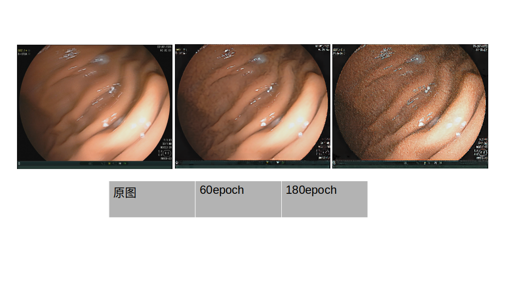
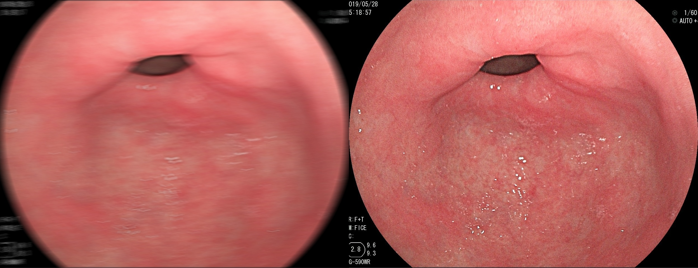

# Deblurring_Realtisic_by_Blurring
[arxiv](https://arxiv.org/pdf/2004.01860v2.pdf)
- 本仓库是实习期间简单的复现该文中的框架结构，用于自己的数据集deblur，目前效果一般。

## 具体方法与实验结果：
### 方案一，分开训练
- BGAN
    在BGAN中使用普通的GAN网络，输入是真实清晰图片（real_sharp)，采用U-net256作为生成器，生成加模糊后的图像（fake_blur);
    判别器采用PatchDis，将真实世界的模糊（real_blur)与生成模糊（fake_blur)进行判别；

    **Note**：其中G使用real_sharp的合成运动模糊图像syth_blur进行预训练，有初步的加模糊能力，预训练采用的是pix2pix的条件GAN，参数设置默认。

    - BGAN结构如图：
    

    - 文章BGAN结构图：
    

    - 此外，我们尝试了加噪声与不加噪声生成模糊对比，结果如下：
    

- DBGAN
    训练完BGAN后，将BGAN的生成器冻住，判别器去掉，使用pix2pix作为DBGAN的生成器，判别器采用PatchDis，进行去模糊
    - 实验结果如下：
    
    
    - 真实场景测试：
    

可以看出，稍微有一点效果。
### 方案二，一起训练
- BGAN和DBGAN一起训练，DBGAN对于BGAN的合成模糊图片去模糊效果非常好，但是到后期会出现非常奇怪的纹理以及噪声，前期当不出现这种纹理时，去模糊效果几乎没有。
    - 结果如图(180个epoch):

    - 60epoch真实场景模糊测试结果：

    - 与方案一对比：

.gif)

可以看出，DBGAN仿佛是学到了某种特别的方式来去模糊:)

## Somthing-Note
- RBL_Loss,可以参考[Deblurring-pytorch](https://github.com/jkhu29/Deblurring-by-Realistic-Blurring)中RBL的实现
- 由于是医学图像，采用U-Net结构确实比ResNet结构好一些，例如色调的变化会在几个epoch后就收敛，而ResNet收敛很慢。
- 没有使用norm
- concat噪声是沿通道拼接
- 由于加噪声之后附加模糊不太理想，我们选择了不加噪声来进行方案二
- 由于U-Net有connect结构，所以选择了resize+crop方式，resize到1200，crop到1024，此外，后续也尝试过原图输入（需满足图像尺度/2**下采样层数，例如，下采样为5层，图像宽高都需被2的5次方整除，才能原图输入），但生成结果比较模糊，可以使用[pix2pixHD](https://github.com/NVIDIA/pix2pixHD)尝试一下
- Perceptual_loss和Frequency_loss的作用比较小，但建议加上感知损失，频域损失貌似更适合调优。
- 在方案二中泛化效果不好，猜想是BGAN没有学到模糊的多样性，致使DBGAN直接去记住了内容来恢复图像
## How-to-train
- 配置环境
- 设置自己的数据集路径
- 设置参数，具体参考[Pix2Pix](https://github.com/junyanz/pytorch-CycleGAN-and-pix2pix)

- ### 配置环境
    - 参考[Pix2Pix](https://github.com/junyanz/pytorch-CycleGAN-and-pix2pix)
- ### 配置数据集
    采用方案二，需要输入real_sharp（真实清晰图像）,real_blur（真实世界模糊图像）,syth_blur（合成模糊图像）,real_sharp和real_blur不是成对的
    syth_blur通过该[仓库](https://github.com/LeviBorodenko/motionblur)生成，并将syth_blur和real_sharp拼接成如下格式(data_tools中有工具)：
    
    之后划分数据集，建议所有成对图片都用来训练，测试代码是直接看真实场景去模糊效果
    路径设置./datasets/deblur_syth/train
    real_blur的数据路径设置在./data/aligned_dataset.py中self.dir_C，设置为真实世界的模糊图像文件路径，也就是你准备真实场景中去模糊的图片
- ### 设置参数
    - train
     bash ./scripts/train_realtisic.sh
    - test（确切的说，是测试真实场景去模糊）
     bash ./scripts/test_realtisic.sh
