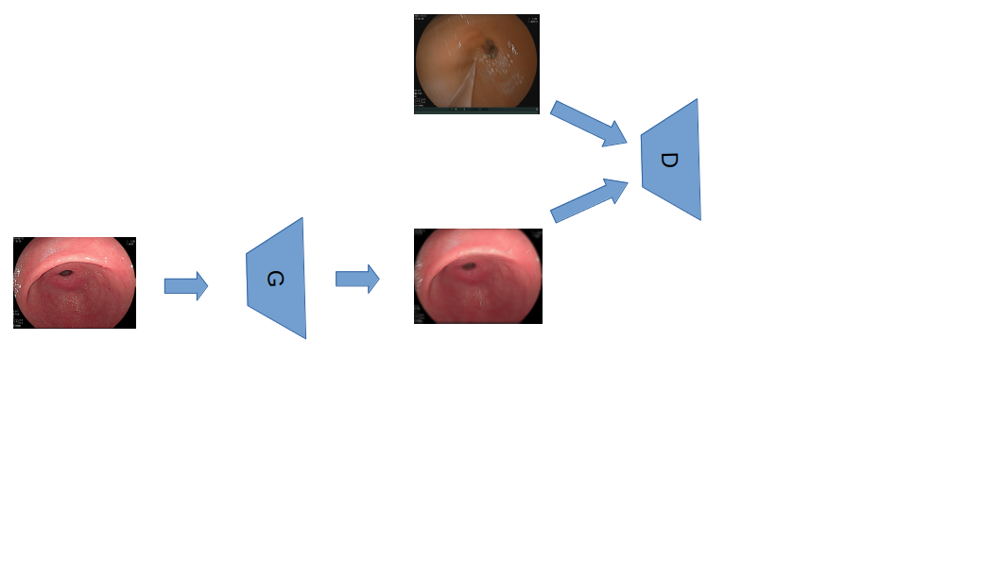
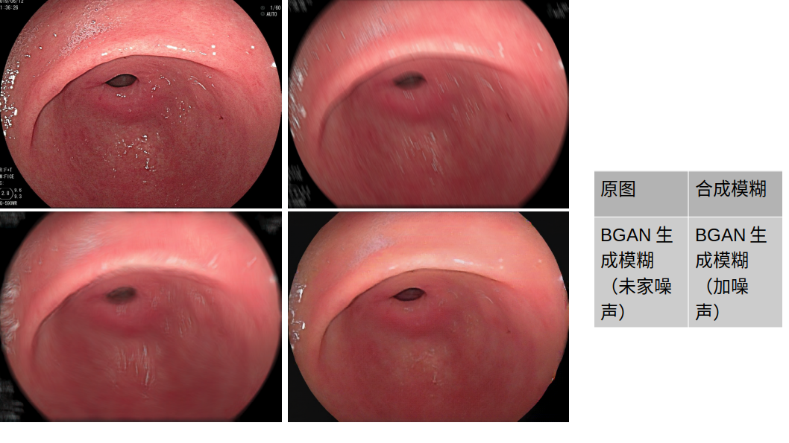
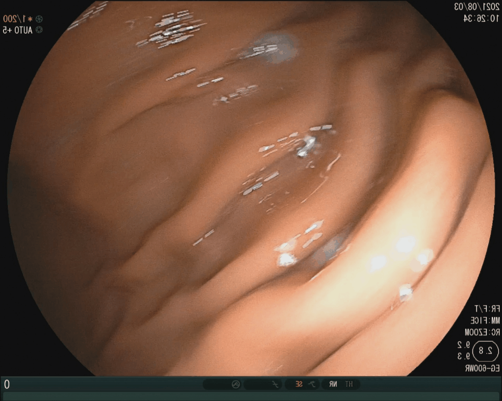
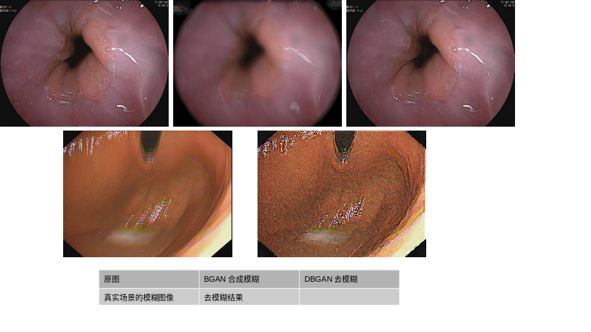
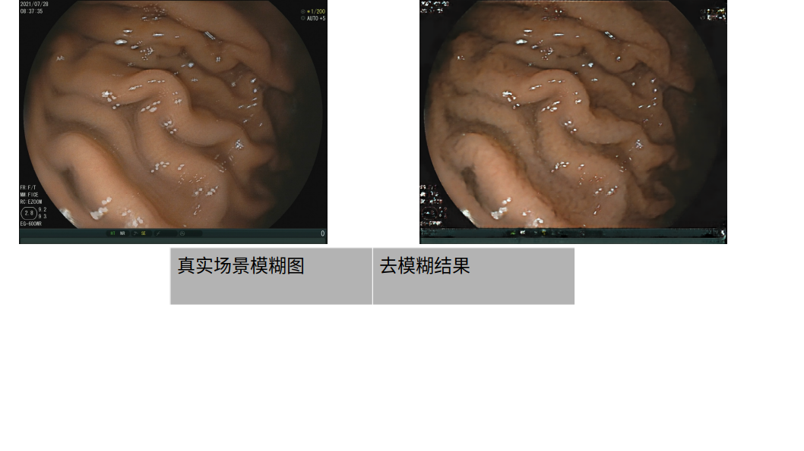

# Deblurring_Realtisic_by_Blurring
- 本仓库是简单的复现该文中的框架结构，用于自己的数据集deblurring，目前效果不太理想。

## 具体方法与实验结果：
### 方案一，分开训练
- BGAN
    在BGAN中使用普通的GAN网络，输入是真实清晰图片（real_sharp)，采用U-net256作为生成器，生成加模糊后的图像（fake_blur);
    判别器采用PatchDis，将真实世界的模糊（real_blur)与生成模糊（fake_blur)进行判别；

    **Note**：其中G使用real_sharp的合成运动模糊图像syth_blur进行预训练，有初步的加模糊能力，预训练采用的是pix2pix的条件GAN，参数设置默认。

    - BGAN结构如图：
    

    - 文章BGAN结构图：
    

    - 此外，我们尝试了加噪声与不加噪声生成模糊对比，结果如下：
    

- DBGAN
    训练完BGAN后，将BGAN的生成器冻住，判别器去掉，使用pix2pix作为DBGAN的生成器，判别器采用PatchDis，进行去模糊
    - 实验结果如下：
    
    
    - 真实场景测试：
    

可以看出，稍微有一点效果。
### 方案二，一起训练
- BGAN和DBGAN一起训练，DBGAN对于BGAN的合成模糊图片去模糊效果非常好，但是到后期会出现非常奇怪的纹理以及噪声
    - 结果如图(180个epoch):

    - 60epoch真实场景模糊测试结果：

.gif)

可以看出，DBGAN仿佛是学到了某种特别的方式来去模糊:)

## Somthing-Note
- RBL_Loss,可以参考[Deblurring-pytorch](https://github.com/jkhu29/Deblurring-by-Realistic-Blurring)中RBL的实现
- 由于是医学图像，采用U-Net结构确实比ResNet结构好一些，例如色调的变化会在几个epoch后就收敛，而ResNet收敛很慢。
- 没有使用norm
- Perceptual_loss和Frequency_loss的作用比较小，但建议加上感知损失，频域损失貌似更适合调优。
## How-to-train
- 配置环境
- 设置自己的数据集路径
- 设置参数，具体参考[Pix2Pix](https://github.com/junyanz/pytorch-CycleGAN-and-pix2pix)

- ### 配置环境